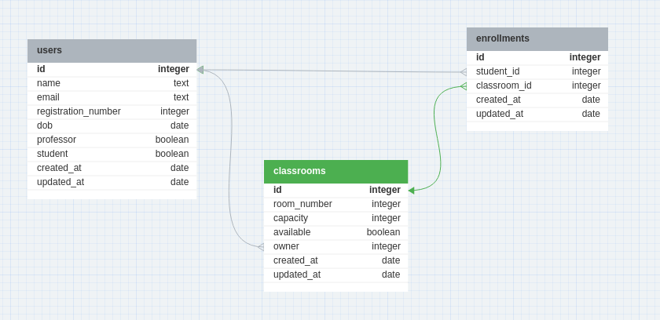

# API para Gerenciamento Escolar

Esta é uma API para gerenciamento de matrículas escolares e fornece funcionalidades para facilitar o cadastro e alocação de salas de aula para seus professores e alunos. 

## Rotas da API 

- POST        /api/classroom
- GET         /api/classroom/:id 
- PUT         /api/classroom/:id 
- DELETE      /api/classroom/:id 
- POST        /api/enrollment 
- GET         /api/enrollment/:id 
- GET         /api/enrollment/student/:id 
- DELETE      /api/enrollment/:id 
- POST        /api/user 
- GET         /api/user/:id 
- PUT         /api/user/:id 
- DELETE      /api/user/:id

## Desenvolvimento
As seguintes ferramentas foram utilizados na construção desta API:

 
 
  
  

## Modelagem Banco de Dados

